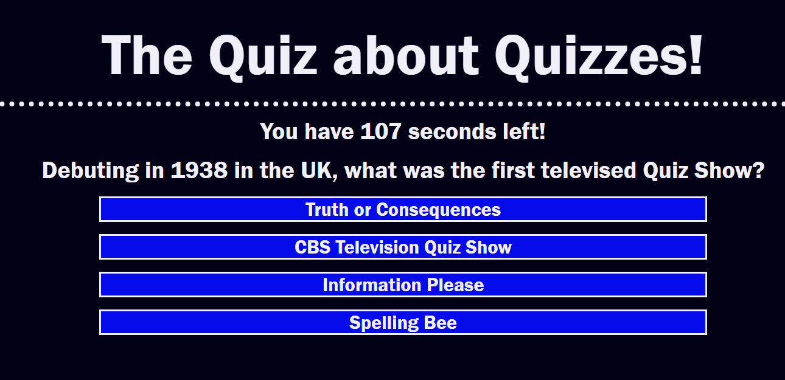

# Create a Quiz

For this assignment, I was to create a quiz with a few sporadic features added in. 

## Link to Deployed Application 

<https://johnkersey2.github.io/the-quiz-about-quizzes-/>

## Application Screenshot 

## Criteria

According to the user story, I was to create a quiz with the following acceptance criteria. 

The quiz starts when user clicks a start button

A timer starts and the user is presented with a question

When one question is answered, another appears

When a question is answered incorrectly, the timer is decremented 15 seconds

The quiz had to stop asking questions when the clock reached 0 or the user completed all questions

After the quiz was over, the user could save their initials and score. 

## Known Issues 
Function to save initials not written

Footer to show saved score not implemented

## Fixed Issues 
Main program functionality fixed

Ability to answer questions fixed

Rewriting of questions and answers fixed

Tracking of score fixed

Decrement of time on incorrect answer fixed

Added Q and A copy to arrays

##  Current Development Notes
Add a footer that will appear only when initials are saved, and will pull from local storage 

Change arrays to arrays of objects to make changing of questions easier for future developers.

Double check if globally declared variables can be declared locally

Test time needed to make quiz feel competitive and fun

## Future Development Notes
Potential features to add:

Display when questions are answered correctly or incorrectly

Change functionality of scoreboard to only show highest score, or if possible, 3 highest scores

Add time taken to complete to scoreboard

Try again button (reload page)

Add buttons for different quizzes.

Add endless mode. 